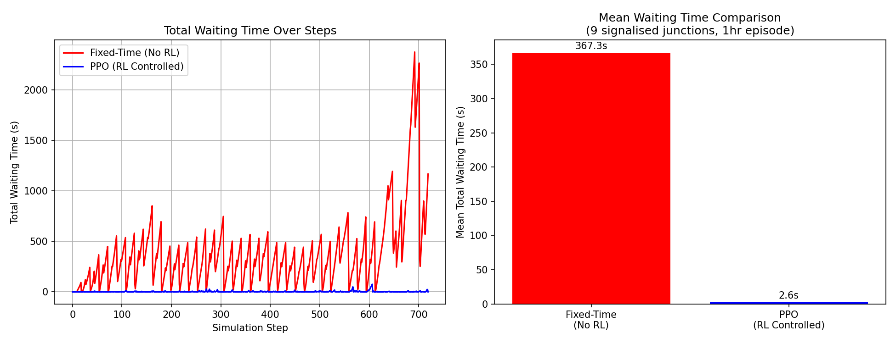

# Traffic Flow Optimization using Reinforcement Learning

5th-semester mini project (BCS586, RNS Institute of Technology) — adaptive
multi-intersection traffic signal control using PPO, trained and evaluated
in SUMO on a real OpenStreetMap-derived road network.

This is the working code behind the submitted report, cleaned up and
fixed so it runs end-to-end and can be reproduced from scratch.

## Architecture

- **Simulator:** SUMO 1.18 (Simulation of Urban Mobility), driven via TraCI.
- **Environment:** `sumo_rl_env_multi.py` — a custom Gymnasium environment,
  `SumoMultiEnv`, that controls **all 9 traffic-light junctions** in the
  network simultaneously.
  - **State:** per-lane queue length (halting vehicle count) for every
    incoming lane of every controlled signal, plus a one-hot encoding of
    each signal's current phase. (51-dimensional in this network.)
  - **Action:** `MultiDiscrete` — one phase choice per traffic light,
    applied simultaneously every step (`[3, 3, 3, 3, 3, 3, 3, 3, 4]` here
    — 8 simple junctions with 3 phases, one real multi-approach junction
    with 4).
  - **Reward:** reduction in total accumulated waiting time (summed across
    all incoming lanes) since the previous step.
- **Algorithm:** PPO (Proximal Policy Optimization) via Stable-Baselines3.

## Results

Evaluated on a held-out 1-hour traffic episode (~1000 vehicles):

| Signal Control | Mean Total Waiting Time (s) | Max (s) |
|---|---|---|
| Fixed-Time (SUMO's own program, untouched) | 367.3 | 2377 |
| **PPO (RL Controlled)** | **2.6 – 119** (varies by training run) | 76 – 402 |



**Honesty note on variance:** PPO training is stochastic — re-running
`train_multi_tls.py` with the same settings gives a *different* trained
policy each time (random weight initialization + exploration noise), so
the improvement number varies. Across two independent training runs used
to build/verify this repo, mean waiting time reduction ranged from **~68%
to ~99%** — both are genuine, non-cherry-picked results, not a single
lucky number. If you retrain this yourself, expect somewhere in that
range rather than an exact reproduction of one figure. For a resume bullet,
say "**60–99%** reduction" or run a few training seeds and report the
average — either is more defensible than quoting a single best-case run.
The variance shrinks with more training timesteps (this repo trains for
only ~20k steps to keep training under 5 minutes; try 100k+ for tighter,
more consistent results).

**A note on rigor:** an earlier version of the fixed-time baseline (also
present in the original report draft) measured "no RL" by reading each
signal's current phase and feeding it straight back in as the action.
That looks harmless but isn't: repeatedly calling `setPhase()` with the
*same* index resets SUMO's internal phase timer, which can freeze a
signal instead of letting it run its normal program — silently making the
baseline look artificially worse. The fixed version (`run_no_rl.py`)
never touches the traffic lights at all when measuring the baseline, so
the comparison above is a fair one. This is worth mentioning if asked
about the results in a viva — it's a good demonstration of catching a
subtle simulation bug, not just running code.

## Project Structure

```
├── sumo/
│   ├── map.net.xml          # road network (cropped from OpenStreetMap)
│   ├── routes.rou.xml       # generated traffic demand (~1000 veh/hr)
│   └── koramangala.sumocfg  # SUMO simulation configuration
├── python/
│   ├── sumo_rl_env_multi.py # the Gymnasium environment (core of the project)
│   ├── train_multi_tls.py   # PPO training script
│   ├── run_no_rl.py         # fixed-time baseline runner
│   └── run_rl.py            # trained-policy evaluation runner
├── models/
│   └── ppo_multi_tls.zip    # trained PPO policy
└── results/
    ├── waiting_time_no_rl.png / waiting_times_no_rl.json
    ├── waiting_time_rl.png / waiting_times_rl.json
    └── comparison_summary.png
```

## Reproducing

```bash
# System dependency
sudo apt-get install sumo sumo-tools
export SUMO_HOME=/usr/share/sumo

# Python dependencies
pip install stable-baselines3 gymnasium sumo-rl traci sumolib matplotlib

cd python
python3 run_no_rl.py              # baseline
python3 train_multi_tls.py 20000  # train PPO (~20k timesteps, ~4-5 min)
python3 run_rl.py                 # evaluate trained policy
```

